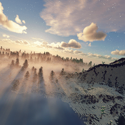

#  CozyUI+ Panorama pack

A simple Minecraft resource pack that only contains panoramas in CozyUI+ pack

Additional links:
[GitHub](https://github.com/MorningMC/CozyUI-panorama-pack)
[Modrinth](https://modrinth.com/project/cozyui-panorama-pack)

## Screenshot 🪟

## License

Copyright (C) 2025 < MorningMC >

This program is free software: you can redistribute it and/or modify
it under the terms of the GNU General Public License as published by
the Free Software Foundation, either version 3 of the License, or
(at your option) any later version.

This program is distributed in the hope that it will be useful,
but WITHOUT ANY WARRANTY; without even the implied warranty of
MERCHANTABILITY or FITNESS FOR A PARTICULAR PURPOSE.  See the
GNU General Public License for more details.

You should have received a copy of the GNU General Public License
along with this program.  If not, see <http://www.gnu.org/licenses/>.

This project is based on [Fogg05/CozyUI-Plus](https://github.com/Fogg05/CozyUI-Plus), 
which is licensed under the GNU General Public License v3.0.
The source code is available at <https://github.com/MorningMC/CozyUI-panorama-pack>.